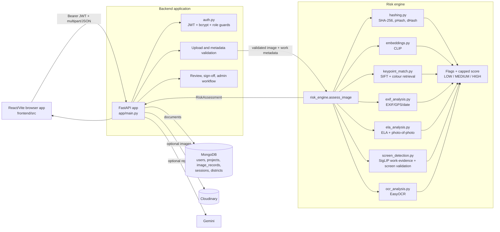
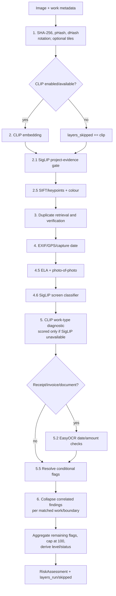
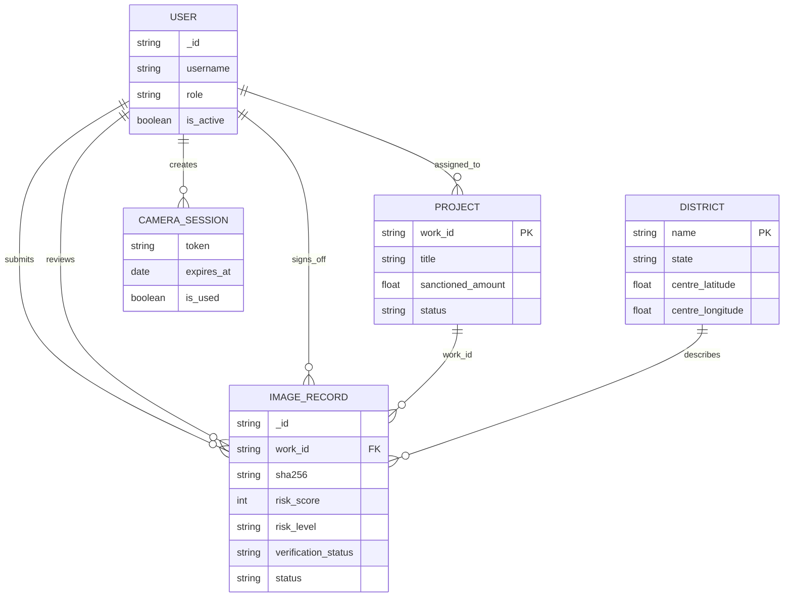
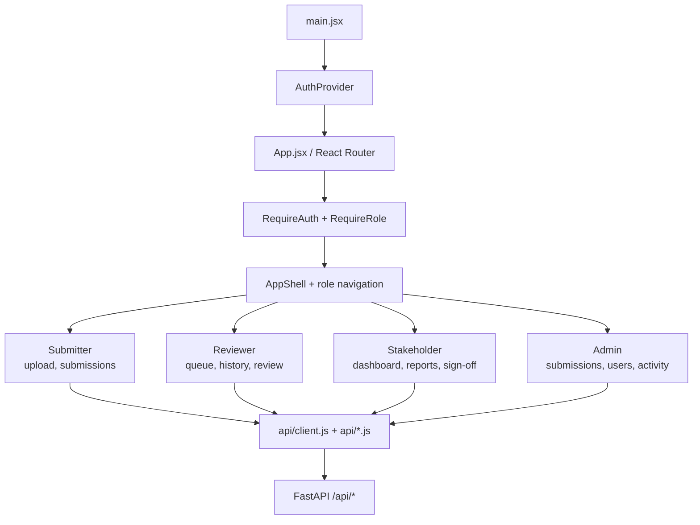

# MPLADS Verify — Code-Derived Architecture

This document describes the system implemented in this repository. It is derived from `app/`, `frontend/src/`, and `tests/`; it is not a product wish-list or a description of an unmounted dashboard.

## 1. Boundaries and ownership

MPLADS Verify has four runtime boundaries:

1. **Browser UI** — React/Vite code in `frontend/src/`.
2. **Backend/application layer** — FastAPI routes and workflow rules in `app/main.py`.
3. **Risk engine** — image evidence extraction and explainable scoring in `app/risk_engine.py`.
4. **Persistence/services** — MongoDB, optional Cloudinary, and optional AI report generation.

The backend owns authentication, authorization, validation, persistence, workflow transitions, and response shaping. The risk engine owns image analysis only. A reviewer decision therefore does not rewrite the automated evidence snapshot, and a UI change does not silently change scoring.

## 2. Runtime topology



### Image request lifecycle

```mermaid
sequenceDiagram
    participant U as Browser
    participant M as main.py
    participant R as risk_engine.py
    participant D as Detection adapters
    participant DB as MongoDB
    U->>M: POST /api/images/check or /api/images/submit
    M->>M: JWT/role, file, and metadata validation
    M->>R: assess_image(temp_path, metadata, db)
    R->>D: hashes, duplicates, metadata, ELA, ML, OCR
    D-->>R: evidence, flags, matches, layer availability
    R-->>M: RiskAssessment
    alt check (dry run)
      M-->>U: response; temporary file deleted
    else submit
      M->>DB: ImageRecord + risk snapshot
      M-->>U: response; status=PENDING_REVIEW
    end
```

## 3. Backend/application layer

`app/main.py` is the application boundary. It:

- initializes MongoDB indexes and optional Cloudinary at startup;
- authenticates with `get_current_user` and restricts roles with `require_role`;
- validates extensions, size, `work_type`, and conditional `sanction_date`;
- saves a temporary upload, calls the engine, and cleans it up;
- optionally uploads the file to Cloudinary;
- persists the risk snapshot and workflow audit fields;
- enforces reviewer, stakeholder, project, and admin transitions;
- maps documents and engine results to `app/schemas.py` responses.

### Implemented endpoint groups

| Group | Endpoints | Purpose |
|---|---|---|
| Auth | `POST /api/auth/register`, `POST /api/auth/login`, `GET /api/auth/me` | Registration, login, profile |
| Upload | `POST /api/images/check`, `POST /api/images/submit` | Dry-run assessment or persisted submission |
| Submitter | `GET /api/images/mine`, `GET /api/images/{work_id}` | Own history and work evidence |
| Reviewer | `GET /api/reviews/queue`, `GET /api/reviews/history`, `GET /api/reviews/ai-summary`, `POST /api/reviews/{id}/claim`, `POST /api/reviews/{id}/decide` | Claim and approve/reject |
| Stakeholder | `GET /api/stakeholder/overview`, `GET /api/stakeholder/reports`, `POST /api/stakeholder/{id}/sign-off` plus AI endpoints | Oversight and final sign-off |
| Projects | `/api/admin/projects/*`, `PATCH /api/projects/{work_id}/phases/{order}`, `GET /api/projects/mine`, `GET /api/dashboard/summary` | Sanctioned works and contractor rollups |
| Admin | `/api/admin/users/*`, `/api/admin/submissions/*`, `GET /api/admin/activity`, `GET /api/admin/ai-summary` | User management, audit, overrides |
| Utility | `GET /api/duplicates`, `GET /api/stats`, `GET /health` | Diagnostics and health |
| Camera sessions | `POST /api/sessions/create`, `POST /api/sessions/validate` | One-use capture tokens |

## 4. Risk engine

`app/risk_engine.py` exposes one orchestration entry point: `assess_image(...)`. It accepts an image path, work metadata, optional amount/device coordinates, and a Mongo database handle. It returns a `RiskAssessment`; it does not approve, reject, sign off, or mutate workflow status.



### Score, level, and verification are different

- **Risk score** is a rule-based evidence index, not a fraud probability. It is
  the capped sum of explainable contributions after correlated duplicate
  findings have been collapsed.
- **Risk level** is `LOW` (0–29), `MEDIUM` (30–59), or `HIGH` (60+).
- **Verification status** is `REQUIRES_REVIEW` when any flag adds points; otherwise it is `INSUFFICIENT_EVIDENCE` when required metadata, models, or layers are missing/borderline; only complete clean evidence is `VERIFIED`.
- **Recommendation** requires manual verification for every non-verified result. A low score is not an approval.

Each `ScoredFlag` carries `code`, `severity`, `message`, `evidence`, and `points_added`.

Exact, perceptual, SIFT/geometric and semantic matches can all observe the same
reused source. Only the strongest base finding per matched work contributes to
the score, and cross-district/cross-MP aggravation contributes at most once per
submission. Suspicious-band semantic neighbours retain boundary context but do
not add a separate boundary penalty. The full raw `DuplicateReport` remains
available to the reviewer.

### Mandatory SigLIP visual validation

`app/screen_detection.py` provides one shared `google/siglip-base-patch16-224` instance for two independent checks. Startup eagerly loads it and aborts if it is disabled or unavailable, so the API never silently accepts submissions without the mandatory gate. First it distinguishes plausible contractor/project evidence from famous-landmark, stock/travel, generic non-project, and unrelated images. Later it compares a screen/software prompt with a natural camera-photo prompt.

- confidently invalid work evidence: `FAMOUS_LANDMARK_SUSPECTED` or `NOT_PROJECT_WORK_EVIDENCE`, high severity, +65;
- ambiguous work evidence: `WORK_EVIDENCE_UNCLEAR`, medium severity, +25;
- the exact reported Golden Gate sample measured 0.5028 landmark/stock versus 0.2591 project evidence; the three legitimate bridge samples measured 0.6885–0.9543 project evidence;
- physical-work submissions also require usable location and capture-time evidence before they can become `VERIFIED`;

- probability `>= 0.90`: `SCREEN_CAPTURE_SUSPECTED`, high severity, +35;
- probability `0.70–<0.90`: no points, but status remains `INSUFFICIENT_EVIDENCE`;
- inference unavailable after a successful startup: the affected layer is recorded in `layers_skipped`, so the result cannot be `VERIFIED`;
- the older ELA screenshot heuristic is disabled by default because it produced false positives; it remains diagnostic only.

For physical work, SigLIP is also authoritative for claimed-work semantics.
CLIP's older zero-shot work-type score is stored as a diagnostic, but it only
creates a content-mismatch flag if the mandatory work-evidence inference is
unavailable. This prevents two correlated models from issuing contradictory
`VALID` and `CONTENT_MISMATCH` decisions for the same photograph.

### Detection adapters

| Module | Evidence | Failure/persistence behavior |
|---|---|---|
| `hashing.py` | SHA-256, pHash, dHash, rotation/tiled hashes | Hashes persist; unreadable images raise `ImageProcessingError` |
| `duplicate_search.py` | Exact, perceptual, semantic, cross-work/district/MP, geometric matches | Queries Mongo; missing candidate features are skipped |
| `embeddings.py` | CLIP embedding and semantic similarity | Lazy load; skipped when unavailable/disabled |
| `keypoint_match.py` | SIFT descriptors, colour signature, RANSAC verification | Retrieve-then-verify; serialized features persist |
| `exif_analysis.py` | Capture date, GPS, EXIF, editing software | Missing EXIF is evidence state, not proof of fraud |
| `ela_analysis.py` | ELA tamper and photo-of-photo signal | Thresholded findings become flags |
| `screen_detection.py` | SigLIP project-evidence class, validity probability, screen probability | Mandatory evidence gates; one shared model instance |
| `ocr_analysis.py` | Receipt text, dates, amounts, mismatches | Required document types cannot verify if OCR is skipped |

## 5. Persistence and workflows

`app/database.py` supplies PyMongo. A `mongomock` URL selects an in-memory database for tests. Startup creates indexes for users, sessions, `image_records.work_id`, unique `projects.work_id`, and project assignees, then seeds districts.



There are two distinct state machines:

- project: `NOT_STARTED → IN_PROGRESS → COMPLETED` or `CANCELLED`;
- image workflow: `PENDING_REVIEW → IN_REVIEW → APPROVED/REJECTED`, then `APPROVED → SIGNED_OFF`.

The risk fields are an upload-time snapshot. Reviewer, stakeholder, and admin actions write separate attributable audit fields instead of overwriting that evidence.

## 6. Contracts and validation

`app/schemas.py` defines request and response contracts. The central `RiskAssessmentResponse` contains the score, level, verification status, recommendation, flags, duplicate report, semantic score, layer availability, processing time, metadata, work-evidence result, and screen-model fields.

```json
{
  "work_id": "MP-PUN-2024-0231",
  "risk_score": 0,
  "risk_level": "LOW",
  "verification_status": "VERIFIED",
  "recommendation": "No action required — image appears legitimate",
  "flags": [],
  "layers_run": ["hashing", "work_evidence", "screen_model"],
  "layers_skipped": [],
  "screen_probability": 0.03,
  "screen_model_name": "google/siglip-base-patch16-224",
  "work_evidence_status": "VALID",
  "work_evidence_probability": 0.91
}
```

Upload extensions are `.jpg`, `.jpeg`, `.png`, and `.webp`. `work_type` is required; `sanction_date` is required for receipt, invoice, and document submissions. `/check` deletes its temporary file; `/submit` persists an `ImageRecord` starting at `PENDING_REVIEW`.

## 7. Frontend architecture

The active frontend is React + Vite + React Router. `main.jsx` mounts `AuthProvider` and `App`; `App.jsx` defines the authenticated tree under `/app`, wrapped by `AppShell`, `RequireAuth`, and `RequireRole`.



| Role | Landing path | Capabilities |
|---|---|---|
| `submitter` | `/app/upload` | Upload, own history, settings |
| `reviewer` | `/app/queue` | Claim/decide, history |
| `stakeholder` | `/app/dashboard` | Oversight, reports, sign-off |
| `admin` | `/app/admin/submissions` | Global submissions, users, activity, overrides |

`frontend/src/api/client.js` attaches the bearer token and normalizes errors. Submitter upload/detail views show verification status, project-evidence validity, capture date, location availability, screen probability, and specific contractor-safe findings; they do not infer approval from risk level alone.

### MP dashboard source tree

`frontend/src/mp/` exists, but `frontend/src/App.jsx` does not import or route to it. It is an unmounted design/integration source tree, not a live runtime surface. Adding it requires explicit routes and role ownership.

## 8. Configuration, deployment, and operations

`app/config.py` centralizes thresholds, weights, feature flags, model names, and limits. Key defaults are:

- `DATABASE_URL` and `JWT_SECRET_KEY` are required settings;
- CLIP enabled with `openai/clip-vit-base-patch32`;
- visual model enabled with `google/siglip-base-patch16-224`; work-evidence invalid `0.48` with `0.15` margin; screen review `0.70`, high `0.90`;
- `sentencepiece` and `protobuf` are required tokenizer dependencies for SigLIP;
- ELA enabled; legacy screenshot detector disabled;
- SIFT/keypoint matching enabled; tiled hashing disabled by default;
- Cloudinary is optional; Gemini summaries are optional and do not affect deterministic scoring.

Models load lazily on first use. Disabled/unavailable detectors appear in `layers_skipped`; because the screen model is enabled by default, its absence prevents `VERIFIED`.

```bash
uvicorn app.main:app --reload
ENABLE_SCREEN_MODEL=true uvicorn app.main:app --reload
pytest -q
git diff --check
```

`GET /health` reports database and model availability. Assessment responses include `processing_time_ms`, `layers_run`, and `layers_skipped` for diagnosis.

## 9. Limitations and extension rules

- Automated risk is decision support; human review and stakeholder sign-off remain workflow stages.
- CLIP, EasyOCR, and SigLIP require model downloads and runtime resources.
- Perceptual hashes can miss extreme crops/viewpoint changes; SIFT reduces but does not eliminate that gap.
- Retrieval-then-verification keeps geometric matching bounded but needs production-scale calibration.
- Missing EXIF is not proof of fraud.
- AI reports are advisory and isolated from fraud scoring.

Add new detectors as structured-evidence adapters called by `assess_image`. Add workflow actions in `main.py` with role guards and audit fields. Keep database writes and role transitions out of detector modules.
