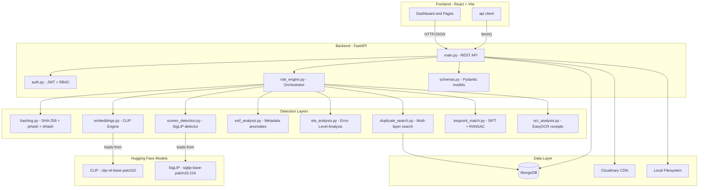
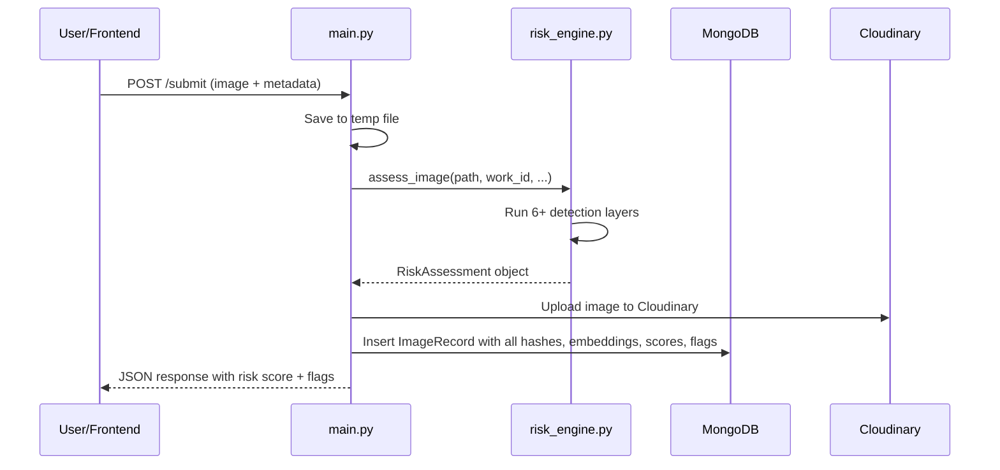
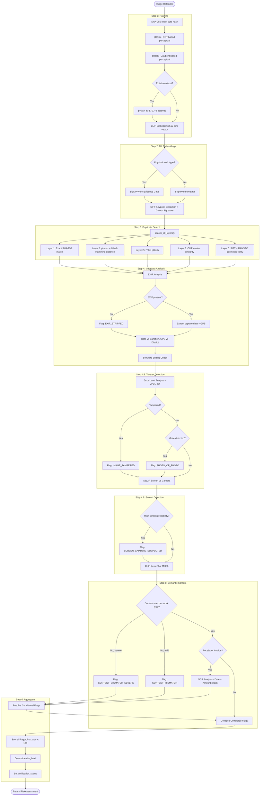
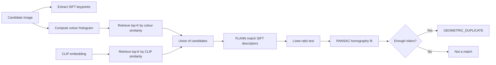
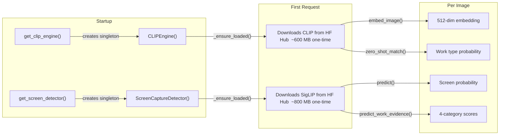
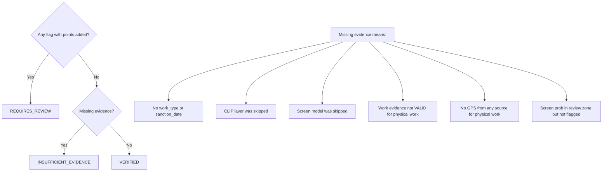

# MPLADS Image Fraud & Anomaly Detection — Full Project Deep Dive

> **Source of truth**: Every detail below was extracted by reading the actual source code in [`app/`](file:///Users/ankit/.gemini/antigravity-ide/scratch/mplads_image_module/app), not from README or architecture docs.

---

## 1. High-Level System Architecture



---

## 2. Backend Design

### 2.1 Tech Stack

| Component | Technology | File |
|---|---|---|
| Web Framework | **FastAPI** | [`main.py`](file:///Users/ankit/.gemini/antigravity-ide/scratch/mplads_image_module/app/main.py) |
| Database | **MongoDB** (PyMongo) / **mongomock** for testing | [`database.py`](file:///Users/ankit/.gemini/antigravity-ide/scratch/mplads_image_module/app/database.py) |
| Auth | **JWT** tokens + bcrypt password hashing | [`auth.py`](file:///Users/ankit/.gemini/antigravity-ide/scratch/mplads_image_module/app/auth.py) |
| Config | **pydantic-settings** (env var override) | [`config.py`](file:///Users/ankit/.gemini/antigravity-ide/scratch/mplads_image_module/app/config.py) |
| Image Storage | **Cloudinary** CDN + local `data/images/` fallback | [`main.py`](file:///Users/ankit/.gemini/antigravity-ide/scratch/mplads_image_module/app/main.py) |
| API Docs | Auto-generated **Swagger UI** at `/docs` | FastAPI built-in |

### 2.2 Role-Based Access Control (RBAC)

Defined in [`models.py`](file:///Users/ankit/.gemini/antigravity-ide/scratch/mplads_image_module/app/models.py):

| Role | Constant | Permissions |
|---|---|---|
| `submitter` | `ROLE_SUBMITTER` | Upload images, view own submissions |
| `reviewer` | `ROLE_REVIEWER` | Review flagged images, approve/reject |
| `stakeholder` | `ROLE_STAKEHOLDER` | Read-only dashboards & reports |
| `admin` | `ROLE_ADMIN` | Full access, user management |
| `mp` | MP role | Constituency-level view |

### 2.3 Data Models (MongoDB Collections)

From [`models.py`](file:///Users/ankit/.gemini/antigravity-ide/scratch/mplads_image_module/app/models.py):

```
image_records     — The core collection. Each document stores:
├── work_id, district, state, mp_name
├── file_path (Cloudinary URL or local path)
├── sha256, phash, dhash          ← Layer 1 & 2 hashes
├── embedding (binary blob)        ← Layer 3 CLIP vector
├── orb_features (binary blob)     ← Layer 6 SIFT keypoints
├── color_signature (binary blob)  ← Layer 6 colour histogram
├── tile_phashes (JSON string)     ← Optional tiled hashes
├── risk_score, risk_level, flags[]
├── gps_latitude, gps_longitude
├── captured_latitude, captured_longitude, geolocation_accuracy
├── verification_status, workflow status
└── timestamps, reviewer notes

users             — Username, hashed password, role, district
projects          — MPLADS project tracking
districts         — Name → (centre_latitude, centre_longitude)
camera_sessions   — Device camera capture metadata
```

### 2.4 Request Flow — Image Submission



---

## 3. The Risk Engine — Complete Pipeline

[`risk_engine.py`](file:///Users/ankit/.gemini/antigravity-ide/scratch/mplads_image_module/app/risk_engine.py) — **1,213 lines**, the heart of the system.

### Entry Point: `assess_image()`

```python
def assess_image(
    image_path, work_id, work_type, district, state,
    mp_name, sanction_date, session,
    claimed_amount=None,
    captured_latitude=None, captured_longitude=None,
    geolocation_accuracy=None,
) -> RiskAssessment
```

Returns a `RiskAssessment` with:
- `risk_score` (0–100, capped)
- `risk_level` ("LOW" / "MEDIUM" / "HIGH")
- `flags[]` — every point is traceable to a named flag
- `verification_status` — "VERIFIED" / "INSUFFICIENT_EVIDENCE" / "REQUIRES_REVIEW"
- `recommendation` — human-readable action item
- `layers_run[]` / `layers_skipped[]` — full transparency

### Step-by-Step Pipeline



---

## 4. Every Detection Layer — What It Actually Does

### Layer 1: SHA-256 Exact Hash
**File**: [`hashing.py`](file:///Users/ankit/.gemini/antigravity-ide/scratch/mplads_image_module/app/hashing.py) → `compute_sha256()`

| What | Detail |
|---|---|
| **Algorithm** | SHA-256 over raw file bytes (8 KB chunks) |
| **Output** | 64-char hex string |
| **Catches** | Exact byte-for-byte re-uploads |
| **Defeats** | Any modification — even re-saving changes the hash |
| **Speed** | ~1ms |

### Layer 2: Perceptual Hashing (pHash + dHash)
**File**: [`hashing.py`](file:///Users/ankit/.gemini/antigravity-ide/scratch/mplads_image_module/app/hashing.py)

| Sub-layer | Algorithm | What It Captures |
|---|---|---|
| **pHash** | DCT (Discrete Cosine Transform) on 8×8 grayscale | Low-frequency image structure. Survives resize, recompression, minor crop |
| **dHash** | Gradient direction between adjacent pixels | Local brightness gradients. Complements pHash on heavy crops |
| **Rotation-robust pHash** | Hash at -5°, 0°, +5° angles, take minimum Hamming distance | Small rotations that defeat standard pHash |
| **Tiled pHash** | 3×3 grid of overlapping tiles, each pHashed independently | Heavy crops (inner tiles survive). Currently **OFF** by default |

**Hamming Distance Thresholds** (from [`config.py`](file:///Users/ankit/.gemini/antigravity-ide/scratch/mplads_image_module/app/config.py)):
```
pHash:  ≤5 = DUPLICATE (CERTAIN)    6-10 = SUSPICIOUS (POSSIBLE)
dHash:  ≤3 = DUPLICATE (CERTAIN)    4-6  = SUSPICIOUS (POSSIBLE)
```

**Comparison**: Brute-force O(n) scan of all stored hashes. Fine for ~100K images. Beyond that → BK-tree or dedicated hash index.

### Layer 3: CLIP Semantic Embeddings
**File**: [`embeddings.py`](file:///Users/ankit/.gemini/antigravity-ide/scratch/mplads_image_module/app/embeddings.py) → `CLIPEngine`

| What | Detail |
|---|---|
| **Model** | `openai/clip-vit-base-patch32` from Hugging Face |
| **Size** | ~600 MB download on first use |
| **Output** | 512-dim L2-normalised float32 vector |
| **Catches** | Same scene from different angle, heavily altered copies |
| **How** | Cosine similarity (= dot product of normalised vectors) against all stored embeddings |
| **Loading** | Lazy singleton — model loads on first `embed_image()` call, not on import |

**Thresholds**:
```
≥ 0.90 cosine = LIKELY duplicate (same scene, different angle)
≥ 0.85 cosine = POSSIBLE (worth human review)
```

**Calibration** (measured on real photos, n=20, 190 different pairs):
- Same scene pairs: 0.9263 – 0.9508
- Different images max: 0.8624
- Clean gap between 0.8624 and 0.9263

**Zero-Shot Content Matching** (`zero_shot_match()`):
- Compares image against positive prompts for the claimed `work_type` + negative contrast labels
- Returns softmax probability (0–1) that image depicts the claimed work
- Uses domain-specific prompt sets from `settings.WORK_TYPE_PROMPTS` for known MPLADS categories

### Layer 4: EXIF Metadata Analysis
**File**: [`exif_analysis.py`](file:///Users/ankit/.gemini/antigravity-ide/scratch/mplads_image_module/app/exif_analysis.py) → `analyse_metadata()`

Runs **6 independent checks**:

| Check | Flag Code | Severity | What It Detects |
|---|---|---|---|
| **No EXIF data** | `EXIF_STRIPPED` | MEDIUM* | Metadata removed — hides location/date/editing |
| **Photo before sanction** | `PHOTO_PREDATES_SANCTION` | HIGH | Recycled old photo as new evidence |
| **Future-dated photo** | `PHOTO_FUTURE_DATED` | HIGH | Clock manipulation or EXIF tampering |
| **No GPS from any source** | `GPS_MISSING` | LOW | Can't verify location (informational, 0 points) |
| **GPS far from district** | `GPS_DISTRICT_MISMATCH` | HIGH | Photo taken outside claimed district (Haversine formula, threshold: configurable km) |
| **Editing software** | `SOFTWARE_EDITED` | MEDIUM | Photoshop, GIMP, Lightroom etc. in EXIF Software tag |

*\*EXIF_STRIPPED uses **conditional weighting**: 5 points if alone (common innocent case — WhatsApp strips EXIF), 15 points if combined with OTHER suspicious flags.*

**GPS Sources** (priority order):
1. EXIF GPS embedded in image
2. Device GPS from browser `navigator.geolocation` (fallback)
3. Device accuracy radius is checked — coarse IP-based fixes (>50 km accuracy) are discarded

### Layer 4.5: Error Level Analysis (ELA)
**File**: [`ela_analysis.py`](file:///Users/ankit/.gemini/antigravity-ide/scratch/mplads_image_module/app/ela_analysis.py)

| Sub-check | How It Works | What It Catches |
|---|---|---|
| **Tamper detection** | Re-save JPEG at quality 95, compute pixel-by-pixel difference. Spliced regions compress differently → uneven error levels | Copy-paste splicing, content editing |
| **Photo-of-photo** | 2D FFT frequency analysis → detect moiré patterns (regular spectral peaks in mid-frequency band) | Camera photographing a printed photo or digital screen |
| **Screenshot** *(OFF by default)* | Unnaturally uniform error levels (std < 5, mean < 3) | Rendered/generated images. Disabled due to 100% false positive rate on real camera JPEGs |

**No ML required** — pure image processing with PIL + numpy. ~50ms per image.

### Layer 4.6: SigLIP Screen Detection
**File**: [`screen_detection.py`](file:///Users/ankit/.gemini/antigravity-ide/scratch/mplads_image_module/app/screen_detection.py) → `ScreenCaptureDetector.predict()`

| What | Detail |
|---|---|
| **Model** | `google/siglip-base-patch16-224` from Hugging Face |
| **Size** | ~800 MB download on first use |
| **Method** | Binary image/text similarity: "a screenshot of a computer screen" vs "a natural camera photograph" |
| **Output** | `screen_probability` (0–1) |
| **Threshold** | ≥ 0.80 = Flag `SCREEN_CAPTURE_SUSPECTED` (HIGH severity) |

### Layer 5: Semantic Content Verification
**File**: [`risk_engine.py`](file:///Users/ankit/.gemini/antigravity-ide/scratch/mplads_image_module/app/risk_engine.py) (Step 5)

Uses CLIP's zero-shot classification to check if the image **actually depicts the claimed work type**:

```
Example: work_type = "road construction"
Positive labels: "a photograph of road construction", "road being built"...
Negative labels: "unrelated subject", "blurry photo", "screenshot"
→ Returns match probability
```

| Match Score | Flag | Severity | Points |
|---|---|---|---|
| < severe threshold | `CONTENT_MISMATCH_SEVERE` | HIGH | High weight |
| < 60% (normal threshold) | `CONTENT_MISMATCH` | MEDIUM | Medium weight |
| ≥ 60% | No flag | — | 0 |

**Important design**: Only scored when the SigLIP work-evidence gate was unavailable — avoids double-counting correlated evidence from two models.

### Work Evidence Gate (SigLIP)
**File**: [`screen_detection.py`](file:///Users/ankit/.gemini/antigravity-ide/scratch/mplads_image_module/app/screen_detection.py) → `predict_work_evidence()`

This is **separate from and more important than** the CLIP content match. It answers:

> "Is this photo plausible **contractor field evidence**, or is it a landmark/stock/travel image?"

**4 classification categories** (3 prompts each, averaged):

| Category | Example |
|---|---|
| `valid_project_evidence` | "a contractor progress photo of {work_type} at a local public works site in India" |
| `famous_landmark_or_stock` | "a tourist photograph of a famous internationally recognizable landmark" |
| `generic_non_project_image` | "a scenic photograph of completed infrastructure with no visible local construction work" |
| `unrelated_image` | "a photograph unrelated to the claimed public works project" |

**Why this matters**: A photo of the Golden Gate Bridge IS a "bridge" — it would pass CLIP's content match. But it's NOT evidence that a contractor built a bridge in Pune. This gate catches that.

### Layer 5.2: OCR Receipt Analysis
**File**: [`ocr_analysis.py`](file:///Users/ankit/.gemini/antigravity-ide/scratch/mplads_image_module/app/ocr_analysis.py) → `analyse_receipt()`

Only runs when `work_type` is "receipt", "invoice", or "document".

| What | Detail |
|---|---|
| **Engine** | EasyOCR (English + Hindi), lazy-loaded |
| **Extracts** | Currency amounts (₹/Rs./INR patterns), dates (DD/MM/YYYY, Indian formats) |
| **Cross-checks** | Receipt date vs sanction date, extracted amount vs claimed amount (>20% mismatch) |
| **Flags** | `RECEIPT_DATE_BEFORE_SANCTION`, `RECEIPT_AMOUNT_MISMATCH` |

### Layer 6: SIFT Geometric Verification
**File**: [`keypoint_match.py`](file:///Users/ankit/.gemini/antigravity-ide/scratch/mplads_image_module/app/keypoint_match.py) + [`duplicate_search.py`](file:///Users/ankit/.gemini/antigravity-ide/scratch/mplads_image_module/app/duplicate_search.py)

**The problem**: Heavy crops (>10% per edge) and rotations (>7°) defeat BOTH hash layers. Measured and documented.

**The solution**: A **retrieve-then-verify** architecture:



**Key numbers** (calibrated on real photos):
- SIFT catches 60% per-dimension crops: **20/20** (vs ORB: 16/20)
- False positives on 190 different pairs: **0/190**
- Extraction: ~23 ms/image, verification: ~2.3 ms/pair
- Features stored as binary blob in MongoDB: ~762 KB per record

**Adaptive top-K**: K = max(configured, √n), capped at 500. At 10K images → K=100 (~230ms). At 100K → K=317 (~730ms).

---

## 5. How Hugging Face Models Are Used

### Model 1: CLIP (`openai/clip-vit-base-patch32`)

| Aspect | Detail |
|---|---|
| **Loaded in** | [`embeddings.py`](file:///Users/ankit/.gemini/antigravity-ide/scratch/mplads_image_module/app/embeddings.py) → `CLIPEngine._ensure_loaded()` |
| **From** | Hugging Face `transformers` library: `CLIPModel.from_pretrained()` + `CLIPProcessor.from_pretrained()` |
| **When** | Lazy — first call to `embed_image()` or `zero_shot_match()` |
| **Use 1** | **Image Embedding**: 512-dim vector for duplicate detection (cosine similarity search) |
| **Use 2** | **Zero-Shot Classification**: Compare image against text prompts to verify it matches claimed work type |
| **Use 3** | **Retrieval Index**: One of two signatures used to nominate candidates for SIFT geometric verification |
| **Inference** | CPU only (`torch.no_grad()`, `model.eval()`) |
| **Graceful degradation** | If disabled (`ENABLE_CLIP=False`) or torch unavailable → all methods return `None`, pipeline continues with hash + EXIF only |

### Model 2: SigLIP (`google/siglip-base-patch16-224`)

| Aspect | Detail |
|---|---|
| **Loaded in** | [`screen_detection.py`](file:///Users/ankit/.gemini/antigravity-ide/scratch/mplads_image_module/app/screen_detection.py) → `ScreenCaptureDetector._ensure_loaded()` |
| **From** | Hugging Face `transformers` library: `AutoModel.from_pretrained()` + `AutoProcessor.from_pretrained()` |
| **When** | Lazy — first call to `predict()` or `predict_work_evidence()` |
| **Use 1** | **Screen Detection**: Binary classifier — "screenshot of screen" vs "natural camera photo" |
| **Use 2** | **Work Evidence Validation**: 4-way classifier — valid project evidence vs landmark vs generic vs unrelated |
| **Key insight** | Same model instance serves BOTH functions — avoids loading 800 MB twice |
| **Inference** | CPU only, `logits_per_image` → `softmax` → probability |

### How Models Flow Through the Pipeline



---

## 6. Risk Scoring System

### How Points Are Assigned

Every flag adds a configurable number of points. The total is **capped at 100**.

| Flag Code | Default Points | Severity |
|---|---|---|
| `EXACT_DUPLICATE` (cross-work) | High | HIGH |
| `PERCEPTUAL_DUPLICATE` (cross-work) | High | HIGH |
| `GEOMETRIC_DUPLICATE` (cross-work) | High | HIGH |
| `SEMANTIC_DUPLICATE` (cross-work) | Medium | MEDIUM |
| `CROSS_DISTRICT_MATCH` | Bonus | HIGH |
| `CROSS_MP_MATCH` | Bonus | HIGH |
| `CONTENT_MISMATCH_SEVERE` | High | HIGH |
| `CONTENT_MISMATCH` | Medium | MEDIUM |
| `FAMOUS_LANDMARK_SUSPECTED` | High | HIGH |
| `NOT_PROJECT_WORK_EVIDENCE` | High | HIGH |
| `WORK_EVIDENCE_UNCLEAR` | Medium | MEDIUM |
| `EXIF_STRIPPED` (alone) | 5 | LOW |
| `EXIF_STRIPPED` (with others) | 15 | MEDIUM |
| `GPS_MISSING` | 0 | LOW |
| `GPS_DISTRICT_MISMATCH` | High | HIGH |
| `PHOTO_PREDATES_SANCTION` | High | HIGH |
| `SOFTWARE_EDITED` | Medium | MEDIUM |
| `IMAGE_TAMPERED` | High | HIGH |
| `SCREEN_CAPTURE_SUSPECTED` | High | HIGH |
| `PHOTO_OF_PHOTO` | High | HIGH |
| `SCREENSHOT_DETECTED` *(disabled)* | High | HIGH |

### Risk Levels

```
Score  0–20  →  LOW     →  "No action required"
Score 21–50  →  MEDIUM  →  "Flag for supervisory review"
Score 51–100 →  HIGH    →  "Block payment pending manual verification"
```

### Correlated Flag Collapse

The system **deduplicates** flags from the same underlying event. If SHA-256, pHash, CLIP, and SIFT all detect the same reused photo, only the **strongest** finding is scored. This prevents a single re-upload from hitting 4× the score it should.

```python
# _collapse_correlated_flags() keeps ONE strongest per matched work:
EXACT_DUPLICATE > PERCEPTUAL_DUPLICATE = GEOMETRIC_DUPLICATE > SEMANTIC_DUPLICATE
```

### Conditional Flags

`EXIF_STRIPPED` has **context-dependent scoring**:
- **Alone** (no other risk flags): 5 points, LOW — WhatsApp strips EXIF, it's common
- **With other flags**: 15 points, MEDIUM — EXIF removal is more suspicious when combined with other anomalies

Zero-point flags (like `GPS_MISSING`) **don't count** as "other flags" — they're informational, not evidence.

---

## 7. Verification Status Logic

Beyond risk score, every assessment gets a `verification_status`:



> A score of 0 is NOT a clean bill of health if critical layers couldn't run.

---

## 8. Frontend Structure

```
frontend/src/
├── App.jsx          — React Router, layout
├── main.jsx         — Entry point, ReactDOM
├── index.css        — Global styles (~52 KB)
├── api/             — HTTP client for backend
├── components/      — Reusable UI components
├── context/         — React context (auth, etc.)
├── hooks/           — Custom React hooks
├── lib/             — Utility libraries
├── mp/              — MP-specific views
└── pages/           — Route-level page components
```

---

## 9. Complete File Map

| File | Lines | Purpose |
|---|---|---|
| [`main.py`](file:///Users/ankit/.gemini/antigravity-ide/scratch/mplads_image_module/app/main.py) | 2,363 | All REST API routes, image upload/submit, project management, admin, reports |
| [`risk_engine.py`](file:///Users/ankit/.gemini/antigravity-ide/scratch/mplads_image_module/app/risk_engine.py) | 1,213 | Orchestrates all detection layers, scoring, flag generation |
| [`config.py`](file:///Users/ankit/.gemini/antigravity-ide/scratch/mplads_image_module/app/config.py) | 624 | Every threshold, weight, toggle — all documented with calibration data |
| [`duplicate_search.py`](file:///Users/ankit/.gemini/antigravity-ide/scratch/mplads_image_module/app/duplicate_search.py) | 811 | Multi-layer duplicate finder (SHA-256, pHash, dHash, CLIP, SIFT) |
| [`exif_analysis.py`](file:///Users/ankit/.gemini/antigravity-ide/scratch/mplads_image_module/app/exif_analysis.py) | 495 | EXIF extraction, GPS parsing, date/location/software anomalies |
| [`schemas.py`](file:///Users/ankit/.gemini/antigravity-ide/scratch/mplads_image_module/app/schemas.py) | ~700 | Pydantic request/response models for all API endpoints |
| [`keypoint_match.py`](file:///Users/ankit/.gemini/antigravity-ide/scratch/mplads_image_module/app/keypoint_match.py) | 367 | SIFT extraction, serialization, RANSAC geometric verification |
| [`models.py`](file:///Users/ankit/.gemini/antigravity-ide/scratch/mplads_image_module/app/models.py) | ~350 | MongoDB document schemas (ImageRecord, User, Project, etc.) |
| [`ela_analysis.py`](file:///Users/ankit/.gemini/antigravity-ide/scratch/mplads_image_module/app/ela_analysis.py) | 281 | Error Level Analysis + FFT moiré detection |
| [`embeddings.py`](file:///Users/ankit/.gemini/antigravity-ide/scratch/mplads_image_module/app/embeddings.py) | 274 | CLIP engine — embed images, zero-shot classify |
| [`ocr_analysis.py`](file:///Users/ankit/.gemini/antigravity-ide/scratch/mplads_image_module/app/ocr_analysis.py) | 262 | EasyOCR receipt parsing, amount/date extraction |
| [`screen_detection.py`](file:///Users/ankit/.gemini/antigravity-ide/scratch/mplads_image_module/app/screen_detection.py) | 237 | SigLIP screen detector + work evidence validator |
| [`database.py`](file:///Users/ankit/.gemini/antigravity-ide/scratch/mplads_image_module/app/database.py) | ~130 | MongoDB connection, mongomock for testing |
| [`auth.py`](file:///Users/ankit/.gemini/antigravity-ide/scratch/mplads_image_module/app/auth.py) | ~100 | JWT token creation/validation, password hashing, RBAC |
| [`hashing.py`](file:///Users/ankit/.gemini/antigravity-ide/scratch/mplads_image_module/app/hashing.py) | 264 | SHA-256, pHash, dHash, tiled pHash, rotation-robust pHash, Hamming distance |

---

## 10. Key Design Decisions

1. **Layered defence**: No single layer catches everything. Each compensates for the previous one's weaknesses:
   - SHA-256 catches exact copies but is trivially defeated
   - pHash/dHash survive resize/recompress but not heavy crops
   - CLIP catches scene similarity but can't verify geometry
   - SIFT catches heavy crops/rotations via geometric proof

2. **Explainable scoring**: Every point traces to a named flag with evidence. No black-box numbers.

3. **Graceful degradation**: If any ML model fails to load (torch missing, download fails), the pipeline continues with whatever IS available. `layers_skipped[]` records what didn't run.

4. **Conditional weighting**: EXIF_STRIPPED alone is treated leniently (WhatsApp strips it). Combined with other flags, it's scored more harshly.

5. **Correlated flag collapse**: Multiple detectors seeing the same reuse → scored once, not multiplied.

6. **Retrieve-then-verify**: SIFT is too expensive for O(n) scans. A cheap colour histogram + CLIP retrieve candidates; SIFT only verifies the short list.

7. **Calibrated thresholds**: Every threshold in `config.py` cites measured numbers from real photos, not guesses. False positive rates are documented.
